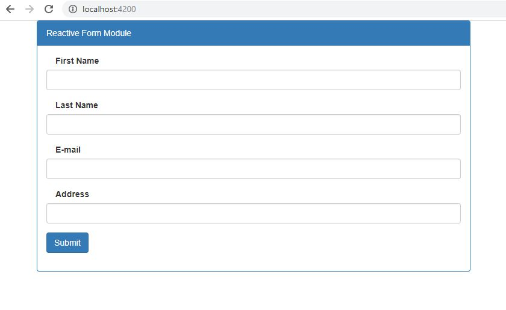
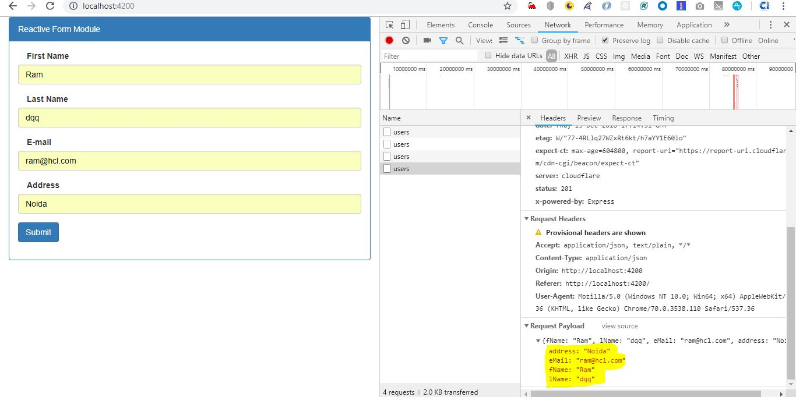

# Reactive form module with post data to web API

This is a Angular7 Sample reactive form module. This is a form that is well validate the form field (e.g first name, last name, email and adderss) before post data to web API.

<p align="center">
    
</p>

To preview demo of Angular7 reactive post method project, [click here](https://angular-reactiveform-post-method.stackblitz.io){:target="_blank"}


## Getting Started
Download  or Clone the repository in your machine and run following command.

### Installing
    - npm install

### Run server
    - ng serve

## Below are the steps to build this component


### Import the module

In `app.module.ts`,

```javascript
...

import { FormsModule, ReactiveFormsModule } from '@angular/forms';
import {HttpClientModule} from '@angular/common/http';


```

### Usage : 

In `app.component.ts`,

```javascript
import { Observable } from 'rxjs'; 
import { HttpClient, HttpHeaders  } from '@angular/common/http';
import { 
	ReactiveFormsModule,
    FormsModule,
    FormGroup,
    FormControl,
    Validators,
    FormBuilder} from '@angular/forms';

export class AppComponent  {
  title = 'angular7-reactive-postMethod';
  myform: FormGroup;	  
    constructor( private http: HttpClient) {
    	this.myform = new FormGroup({
         fName: new FormControl(	'',	[Validators.required, Validators.pattern('^[a-zA-Z]{2,15}$')]),
         lName: new FormControl(  '',  [Validators.required, Validators.pattern('^[a-zA-Z]{2,15}$')]),
         eMail: new FormControl(  '',  [Validators.required, Validators.pattern('^.+@.+\..+$')]),
         address: new FormControl('', 	[Validators.required])
      });  
  	}

  	 get formData() { return this.myform.controls; };
  
 validateForm() { 

for(let i in this.myform.controls)
    this.myform.controls[i].markAsTouched();

}

onSubmit (user: any): void  {
	console.log(user);    
    if (this.myform.valid) {
    let url = "https://reqres.in/api/users";     
        const headers = new HttpHeaders()
          .set('Authorization', 'my-auth-token')
          .set('Content-Type', 'application/json');
      this.http.post(url, user).subscribe(res => console.log("Data Post Done"));
    
	}
	else{this.validateForm()}
  }
}

```


In `app.component.html`,

```html
<form  [formGroup]="myform" (ngSubmit) = "onSubmit(myform.value)">
        <div class="form-group" [ngClass]="{'has-error': !formData.fName.valid && formData.fName.touched}">
          <label class="col-md-4">First Name</label>
          <input type="text" class="form-control" name="fName" formControlName="fName" />
          <div *ngIf="formData.fName.touched && formData.fName.errors" style="margin-top:10px">
        <div class="alert alert-danger" *ngIf="formData.fName.errors.required">
          The First Name is required
        </div>     
          <div class="alert alert-danger" *ngIf="formData.fName.errors.pattern">
              The Name is not valid, Numeric data not allowed
          </div>          
      </div>
        </div>
         <div class="form-group" [ngClass]="{'has-error': !formData.lName.valid && formData.lName.touched}">
          <label class="col-md-4">Last Name</label>
          <input type="text" class="form-control" name="lName" formControlName="lName"/>
          <div *ngIf="formData.lName.touched && formData.lName.errors" style="margin-top:10px">
        <div class="alert alert-danger" *ngIf="formData.lName.errors.required">
          The Last Name is required
        </div>
         <div class="alert alert-danger" *ngIf="formData.lName.errors.pattern">
              The Last Name is not valid, Numeric data not allowed
          </div>
      </div>
          </div>
        <div class="form-group" [ngClass]="{'has-error': !formData.eMail.valid && formData.eMail.touched}">
          <label class="col-md-4">E-mail</label>
          <input type="text" class="form-control" name="eMail" formControlName="eMail"/>
          <div *ngIf="formData.eMail.touched && formData.eMail.errors" style="margin-top:10px">
        <div class="alert alert-danger" *ngIf="formData.eMail.errors.required">
          The E-mail is required
        </div>
         <div class="alert alert-danger" *ngIf="formData.eMail.errors.pattern">
              The E-mail is not valid
          </div>
      </div>
          </div> 
        <div class="form-group" [ngClass]="{'has-error': !formData.address.valid && formData.address.touched}">
          <label class="col-md-4">Address</label>
          <input type="text" class="form-control" name="address" formControlName="address"/>
          <div *ngIf="formData.address.touched && formData.address.errors" style="margin-top:10px">
        <div class="alert alert-danger" *ngIf="formData.address.errors.required">
          The Address is required
        </div>         
      </div>
          </div>
          <div class="form-group">
            <button type="submit" class="btn btn-primary">Submit</button>
          </div>          
      
      </form>
```

#### Below is  the form data post and sending the data on payload
<p align="center">
    
</p>
